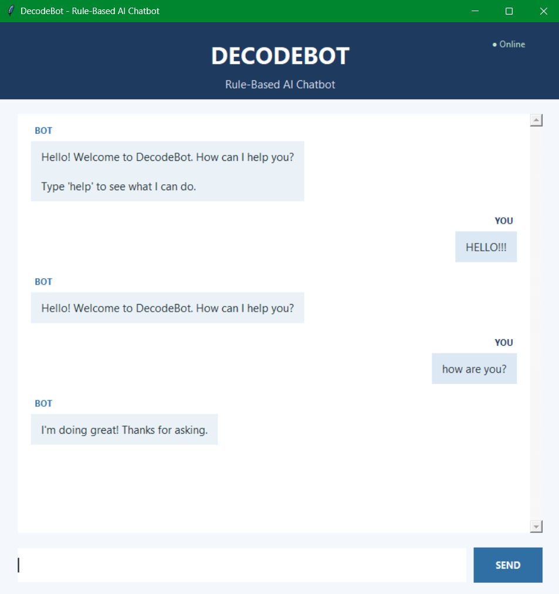
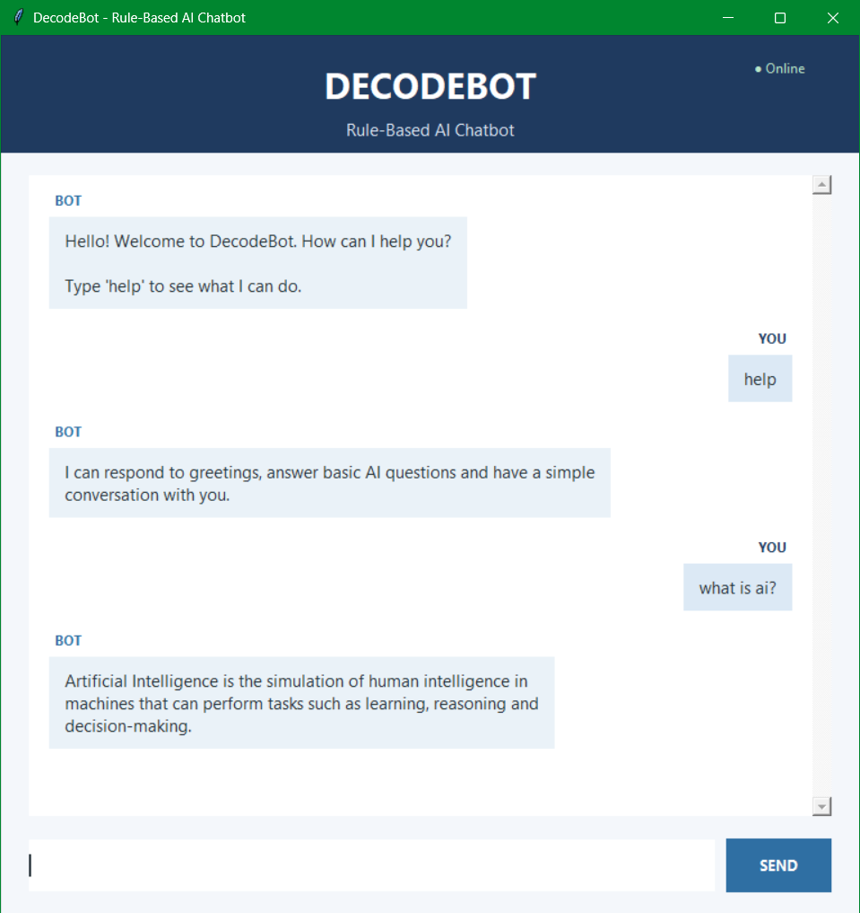

# DecodeBot - Rule-Based AI Chatbot

A simple rule-based AI chatbot developed as Project 1 of the DecodeLabs Artificial Intelligence Internship (Batch 2026).

## Project Overview

DecodeBot is a Python-based chatbot that uses predefined rules and dictionary-based responses to simulate a basic conversation with a user.

The project focuses on fundamental AI concepts such as control flow, decision-making logic, input processing, and rule-based response generation.

## Features

- Handles common greetings such as `hello`, `hi`, and `hey`
- Supports variations such as `hello there` and `hi there`
- Answers basic questions about Artificial Intelligence
- Responds to common conversation inputs such as `how are you`
- Provides a `help` command
- Uses a dictionary-based knowledge base
- Converts user input to lowercase and removes extra spaces
- Handles common punctuation such as `!`, `?`, and `.`
- Provides a fallback response for unknown inputs
- Supports exit commands such as `bye`, `exit`, `quit`, and `goodbye`
- Includes a graphical user interface built with Tkinter
- Supports pressing Enter to send a message

## Technologies Used

- Python
- Tkinter
- Dictionary-based rule matching

## How It Works

The chatbot follows a simple rule-based workflow:

1. The user enters a message.
2. The input is converted to lowercase and cleaned.
3. Common punctuation is removed.
4. The cleaned input is checked against the chatbot's predefined knowledge base.
5. If a matching rule is found, the corresponding response is displayed.
6. If no rule matches, a fallback response is displayed.
7. If the user enters an exit command, the chatbot closes.

## Screenshots

### DecodeBot - Greetings and Conversation



### DecodeBot - AI Question and Help Command



## Project Structure

```text
task-1-rule-based-chatbot/
│
├── chatbot.py
├── README.md
├── chatbot_greetings.png
└── chatbot_ai_conversation.png
