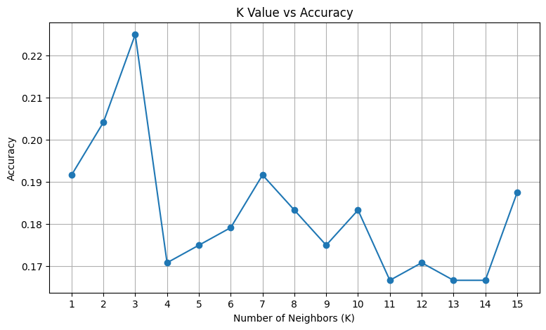
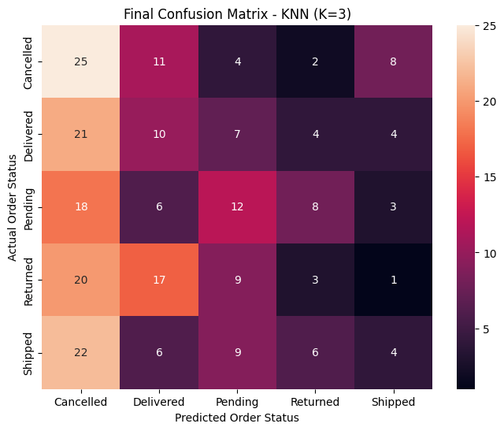

# E-Commerce Order Status Classification Using AI

## DecodeLabs Artificial Intelligence Internship — Project 2

### Data Classification Using AI

This project was developed as part of the DecodeLabs Artificial Intelligence Internship.

The objective of this project is to build a basic supervised machine learning classification model using an e-commerce dataset and predict the order status of different orders.

---

## Project Objective

The project demonstrates a complete supervised learning classification workflow, including:

- Understanding and exploring the dataset
- Selecting relevant features
- Identifying the target variable
- Handling missing values
- Processing date information
- Splitting data into training and testing sets
- Preprocessing numerical and categorical features
- Training a K-Nearest Neighbors (KNN) classifier
- Testing different K values
- Making predictions on unseen data
- Evaluating the model using classification metrics
- Analyzing the confusion matrix

---

## Dataset

The dataset contains **1,200 e-commerce order records** with information about orders, customers, products, payments, shipping, and order status.

### Target Variable

The target variable is:

`OrderStatus`

The model classifies orders into five categories:

- Cancelled
- Delivered
- Pending
- Returned
- Shipped

### Features Used

#### Numerical Features

- Quantity
- UnitPrice
- ItemsInCart
- TotalPrice
- Year
- Month
- Day
- DayOfWeek

#### Categorical Features

- Product
- PaymentMethod
- CouponCode
- ReferralSource

Identifier fields such as `OrderID`, `CustomerID`, `TrackingNumber`, and `ShippingAddress` were excluded from the model inputs.

---

## Data Preprocessing

The following preprocessing operations were performed:

1. Converted the `Date` column into datetime format.
2. Extracted `Year`, `Month`, `Day`, and `DayOfWeek` from the date.
3. Removed the original `Date` column.
4. Replaced missing values in `CouponCode` with `No Coupon`.
5. Standardized numerical features using `StandardScaler`.
6. Converted categorical features using `OneHotEncoder`.
7. Used a preprocessing pipeline to transform the features before classification.

---

## Train-Test Split

The dataset was divided into:

- **80% Training Data**
- **20% Testing Data**

A stratified split was used to maintain the distribution of the order-status classes.

The test set contains **240 observations**.

---

## Classification Algorithm

### K-Nearest Neighbors (KNN)

K-Nearest Neighbors was selected as the classification algorithm.

KNN classifies a new observation by examining nearby training observations and assigning a class based on the neighboring examples.

Different values of **K from 1 to 15** were tested to examine their effect on classification accuracy.

The selected value was:

**K = 3**

---

## Results & Visualizations

### K Value vs Accuracy

The KNN classifier was evaluated using K values from 1 to 15. The experiment was used to identify the K value that produced the highest test accuracy.



### Final Confusion Matrix

The final KNN model with **K = 3** was evaluated using a confusion matrix to examine the relationship between the actual and predicted order-status classes.



---

## Final Model Performance

The final KNN model with **K = 3** produced the following results on the test dataset:

| Metric | Result |
|---|---:|
| Accuracy | 22.50% |
| Weighted Precision | 0.2111 |
| Weighted Recall | 0.2250 |
| Weighted F1 Score | 0.2006 |

The model was evaluated on **240 test observations**.

---

## Conclusion

The final KNN model achieved an accuracy of **22.50%** on the test dataset.

The relatively low classification performance indicates that the available features do not provide strong separation between the five order-status categories.

Overall, the project demonstrates the complete supervised machine learning workflow, including:

- Dataset exploration
- Feature selection
- Data preprocessing
- Handling missing values
- Train-test splitting
- Feature transformation
- KNN model training
- K-value experimentation
- Prediction on unseen data
- Model evaluation
- Confusion matrix analysis

This project provides practical experience with the basic concepts of supervised classification using an e-commerce dataset.

---

## Technologies Used

- Python
- Pandas
- NumPy
- Matplotlib
- Seaborn
- Scikit-learn
- Google Colab / Jupyter Notebook

---

## Project Structure

```text
task-2-data-classification/
│
├── order_status_classification.ipynb
├── Dataset for Data Analytics.xlsx
├── confusion_matrix_final.png
├── k_value_vs_accuracy.png
└── README.md
